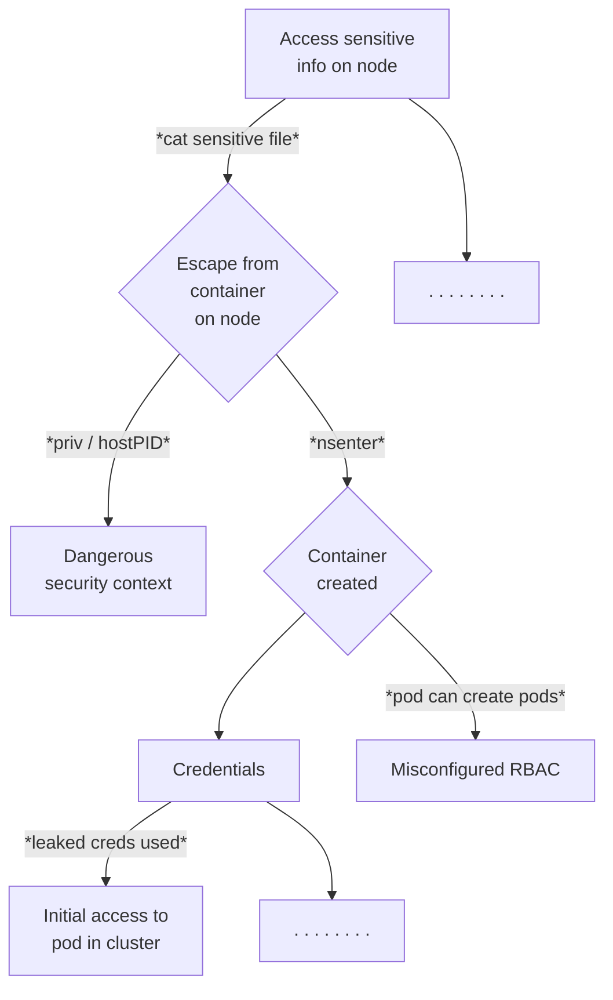

# Honeypots Research

## Simple Attack Tree



## Demo

Spin up a kind cluster:

```bash
make cluster-up
```

Install [Tetragon](https://tetragon.io/):

```bash
make tetragon-install
```

Set up a [vcluster](https://www.vcluster.com/) within our kind cluster where our honeypot workloads will run:

```bash
make vcluster-deploy
```

Install an intentionally vulnerable SSH server from [OWASP SecureCodeBox](https://www.securecodebox.io/):

```bash
make ssh-install
```

Set up a potentially dangerous Cluster Role and Cluster Role Binding enabling a default Service Account to create pods:

```bash
make rbac
```

Set up port forwarding to our SSH server:

```bash
make port-forward
```

Switch to a new terminal tab and copy some scripts over to the SSH server. The password is `THEPASSWORDYOUCREATED`. This represents initial attacker access to our honeypot cluster, via credential compromise:

```bash
make copy-scripts
```

SSH into the server using the same password:

```bash
make ssh-connect
```

From within the SSH session, run a malicious script which will create a privileged pod in the cluster, using the [Python Kubernetes client library](https://github.com/kubernetes-client/python):

```bash
source priv-create.sh
```

Switch to a new terminal tab and observe the privileged pod running:

```bash
kubectl get po
```

Let's show that an attacker could use this pod to escape onto a node in the cluster (in this case we will read the K8s API server's private key):

```bash
make exec
```

## Teardown

```bash
make cluster-down
```
