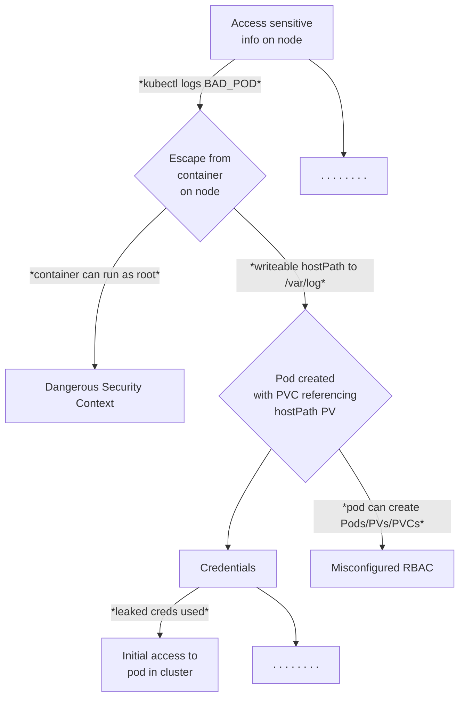

# Honeypots Research

## Simple Attack Tree

As a simple example attack tree, we will look at the attack path made possible if an attacker can create hostPath Persistent Volumes on a cluster, inspred by [this blog post](https://jackleadford.github.io/containers/2020/03/06/pvpost.html).



## Known Issues

tetragon traces are not all created equal, some need improvements

## Demo

Bring all the infra up (known issue: wait conditions):

```bash
make all-up
```

Put the traces on

```bash
make traces
```

You can view the Redpanda dashboard by browsing to: <http://localhost:30000/>

Go to second shell for STDOUT observations (don't kill this shell)

```bash
make secondshell-on
```

Go back to the first shell, and run the attack which will make an SSH connection to our vulnerable server, run a malicious script which will create a HostPath type PersistentVolume, allowing a pod to access `/var/log` on the host (inspired by [this blog post](https://jackleadford.github.io/containers/2020/03/06/pvpost.html)), using the [Python Kubernetes client library](https://github.com/kubernetes-client/python):

```bash
make attack
```

When prompted, the password is `root`.

If the service account compromised by our attacker could inspect the logs of the containers it can create, running `kubectl logs bad-pv-pod --tail=-1` (or making an API call from within the bad pod) will enable an attacker to view arbitrary files (line by line) on the host. In this example, we have a single node cluster, so we can access control plane data.

## Teardown

```bash
make teardown
```

## Note for Mac Users

Certain Docker Desktop versions will lead to the following error:

```text
level=fatal msg="Load overlay network failed" error="program cil_from_overlay: replacing clsact qdisc for interface cilium_vxlan: operation not supported" interface=cilium_vxlan subsys=datapath-loader
```

downgrading or using an alternative (Orbstack) will solve this.
