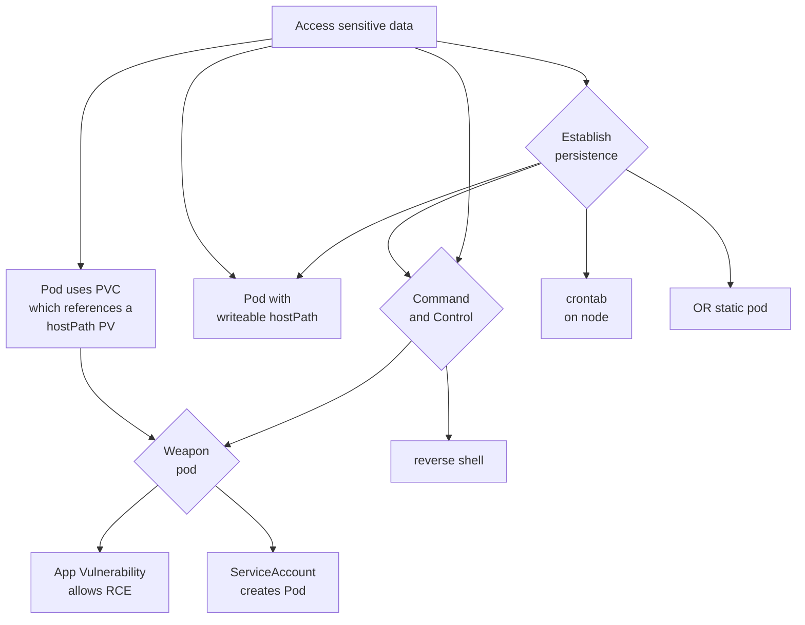
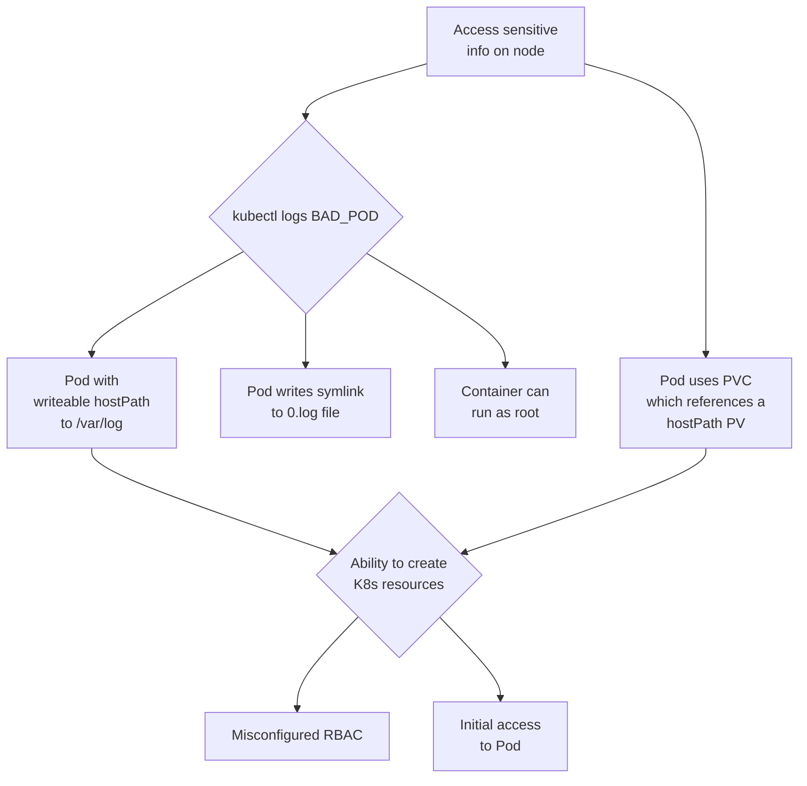
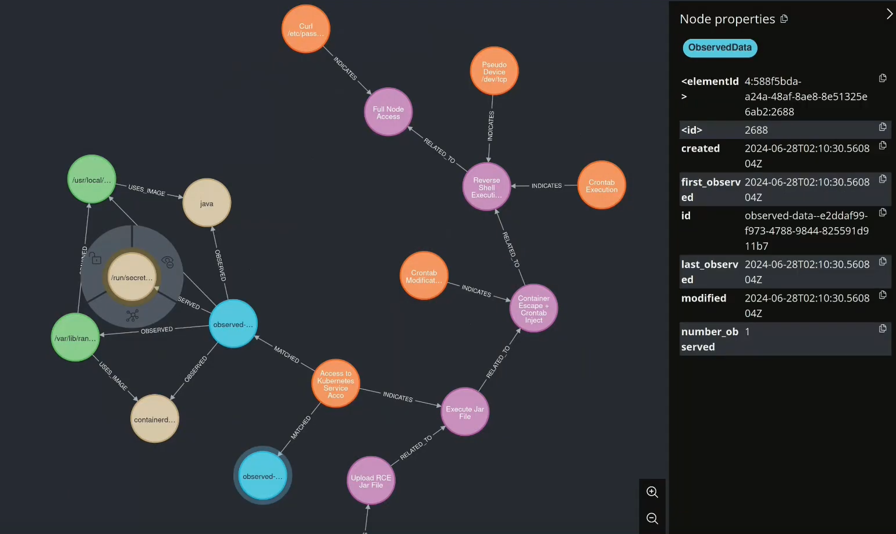

# K8sStormCenter HoneyCluster

> [!NOTE]
> I'm currently rewriting about 90% of the underlying stack, so expect quite some breaking changes until end of 2024. I'm aiming at a stablilization in January '25
> The focus of the rewrite is to give it an achievable UX and a lightweight footprint

Welcome to the K8sStormCenter HoneyCluster repository. Here you will find everything you need to set up your own HoneyCluster, a Kubernetes cluster that is instrumented with bait and tripwires to collect data on the attacks carried out against it and the ways in which it is targeted. WIP: With our complimentary [cti-stix-visualizater](https://github.com/k8sstormcenter/cti-stix-visualization) , you can then use this data to visualize, understand and detect these attacks.


## Table of Contents

- [K8sStormCenter HoneyCluster](#k8sstormcenter-honeycluster)
  - [Table of Contents](#table-of-contents)
  - [How does it work?](#how-does-it-work)
    - [Creating a HoneyCluster](#creating-a-honeycluster)
    - [The four fold path to threat intelligence](#the-four-fold-path-to-threat-intelligence)
    - [Threat Model](#threat-model)
      - [Generate a full Threat Tree using OSS tool such as Kubehound](#generate-a-full-threat-tree-using-oss-tool-such-as-kubehound)
    - [Attack Model](#attack-model)
  - [Getting started](#getting-started)
    - [1. Create a Kubernetes Cluster](#1-create-a-kubernetes-cluster)
    - [2. Set up the HoneyCluster](#2-set-up-the-honeycluster)
    - [3. Baseline Redaction  (DEPRECATED)](#3-baseline-redaction--deprecated)
    - [4. Attack and observe](#4-attack-and-observe)
    - [5. Teardown](#5-teardown)
  - [Tailoring the instrumentation to your needs](#tailoring-the-instrumentation-to-your-needs)
    - [Tracing Policies](#tracing-policies)
    - [Application \& Audit Logs](#application--audit-logs)
    - [Mapping and Matching: Stix Observables and Stix Indicators](#mapping-and-matching-stix-observables-and-stix-indicators)
  - [Experiment: Detect Leaky Vessel on live clusters](#experiment-detect-leaky-vessel-on-live-clusters)
    - [Bait](#bait)
    - [Security Considerations](#security-considerations)
  - [Contributing](#contributing)


## How does it work?

You start with your "normal" cluster, where you wish to

- verify/quantify theoretical threat modelling assumptions, or to
- simply observe how your cluster will be attacked by interpreting the anomalous signals

However, you don't want to expose your cluster to real threats. That's where the HoneyCluster comes in. A HoneyCluster is a cluster that looks like a normal cluster, but is instrumented with tripwires and bait to collect data on the attacks carried out against it. Because the HoneyCluster looks like a real cluster, the collected data is representative of the attacks that would be carried out against a real cluster and therefore can give us insights into the behaviour of attackers and the ways in which they target our clusters.


### Creating a HoneyCluster


To set up a HoneyCluster, you start by creating a copy of your "normal" cluster. This copy has the same services as the real cluster, but without its data and with some additional instrumentation to collect data on the attacks carried out against it. This data is then used to create a baseline of normal behaviour, which is used to filter out benign signals. The remaining signals are then used to detect and understand the attacks carried out against the cluster.

If working locally on `kind`, you might wanna start with 
```bash
make cluster-up
```
[We are currently testing this on kind 1.31.2]


### The four fold path to threat intelligence

The HoneyCluster is a tool to gather data about attack patterns, but on its own, it does not provide us with any actionable insights. To attain knowledge and insights about attacks, the following steps are necessary:

1. Threat Model -> Attack Model -> Critical Attack Path
2. Instrument a honeycluster with eBPF tripwires and some bait
3. Trace and stream events, remove baseline
4. Disseminate the Threat Intelligence


### Threat Model

A relatively generic Threat Model could for example look like this:



#### Generate a full Threat Tree using OSS tool such as Kubehound
One of the critical aspects of modelling threats is having a good threat model to start with. 
This is why we looked at the cloud-native OSS space and are collecting the best tools and combining them
to generate a good starting point. In this branch, we work with `Kubehound`.

### Attack Model

Based on the Threat Model, you now create a concrete AttackModel (or many).

You can use this for multiple purposes:
- to understand if a ThreatModel can be exploited IRL . You can attack yourself or hire an offensive expert, create a bug bounty program etc.
- to  calibrate all event-producing instrumentation in your deployment: can you see events from executing your attack-model, if not, you might need to add more TracingPolicies or change some filters.
- to verify the pattern-matching between your events and your STIX observables: the `cti-stix-visualizer` UI can help calibrating
- to simulate a breach: once you have at least one attack model implemented (e.g. via bash-script), you can test diverse detective/responsive processes in your deployment, e.g. if your pager starts blinking.


## Getting started

You want to deploy your own HoneyCluster? Then you have come to the right place! In a few simple steps, we'll show you everything you need to get started with setting up your own HoneyCluster. We'll guide you through the setup of a local Kubernetes cluster, the installation of the necessary instrumentation and the collection of the baseline behaviour. Once you have set up your HoneyCluster, you can start experimenting with different attacks and observe the signals generated by them.


### 1. Create a Kubernetes Cluster

> [!NOTE]
> If you have already set up a Kubernetes cluster you want to utilize as a HoneyCluster, you can skip this part and head to [step 2](#2-set-up-the-honeycluster). Make sure to have [cert-manager](https://cert-manager.io/docs/) installed on it.

In order to set up your own HoneyCluster, you first need a Kubernetes cluster on which you can install the necessary instrumentation. For local explorative scenarios we provide a Kubernetes setup based on Kind, which you can create using the following command:

```bash
make cluster-up
```
> !NOTE


### 2. Set up the HoneyCluster

> [!IMPORTANT]  
> Make sure to have the correct Kubernetes config context set. From this point on we will make changes to the cluster specified as the current context, and we wouldn't want them to end up on the wrong cluster.

Once you have a running Kubernetes cluster, you can go ahead and install the instrumentation to put the honey in your cluster with the following command:
  
```bash
make honey-up
```

The `honey-up` target installs all the necessary components to collect eBPF traces, application logs and soon audit logs. It is important that the cluster is not yet exposed to an active threat at this point because after the installation we collect the baseline behaviour of the cluster to filter out benign signals.

While we provide you with a set of default traces and log forwarding configurations, you can adjust them to your needs in the [traces](traces/) and [vector/values.yaml](vector/values.yaml) files respectively. Find out more about it in the [Tailoring the instrumentation to your needs](#tailoring-the-instrumentation-to-your-needs) section.

While in `Calibration Mode` , you ll likely want to run your python scripts over your logs to check if the logs (in `Redis`) are being picked up by your `Patterns`. Currently, I m running the python scripts under `./redis/log-notebook/manual.py` in a devcontainer against the `redis` running on `k8s/kind` , while the `cti-stix-visualizer` runs next to `redis`.

```bash
kubectl port-forward service/redis-headless -n redpanda 6379:6379
kubectl port-forward service/stix-visualizer -n redpanda 80:3000
```


After port-forwarding, (and running the python scripts)you can access the detected hash-entries in redis via the UI [http://localhost:30000](http://localhost:30000). WIP !!

Attack yourself with the calibration attacks 1-by-1 or as you like (please un/comment in the Makefile respectively)
```
make --makefile=Makefile_calibrate_kubehound calibrate
```

Then, you need to create your `STIX-bundles` , WIP currently manually
```
cd redis/log-notebook/
poetry run python manual.py
```

You can then look at the Visualisation (WIP, it has hiccups, feel free to suggest improvements):


### 3. Baseline Redaction  (DEPRECATED)

WIP: during the redpanda-deprecation, we now have simple dedup inside vector, where the hashing is done (previsously inside redpanda-wasm-transform), however, inserting the known hashes into seperate hash-tables is currently turned off, until the visualisation features are finished.
You can manually implement it yourself, by letting vector write all hashes to a redis table until your `baseline recording` is done, and then implementing in your analysis scripts to ignore all those hashes.

OLD TEXT:

After the successful HoneyCluster setup, it starts collecting all data on the cluster. The idea is that at this point, all traffic is benign and therefore we can use this data to create a baseline of what non-malicous behaviour looks like. We can then use this baseline to filter out what we are not interested in, leaving us with the good stuff - the signal.


Once you believe that all baseline behaviour has been captured, you can cut off the baseline collection and start the signal generation using the following make target:

```bash
make honey-signal
```

Check out the [signal](http://localhost:30000/topics/signal) topic in the Redpanda dashboard to see the generated signal. This topic should now only contain activity that is not part of the baseline behaviour.

If you still find some reoccuring benign traffic in the signal, you can add the corresponding keys to the `baseline` set in Redis to exclude them from the signal:

```bash
kubectl exec -n redpanda svc/redis-headless -- redis-cli SADD baseline "<key>"
```


### 4. Attack and observe

With the HoneyCluster set up and the baseline behaviour filtered out, you can now perform some previously unseen actions on the cluster and observe the signals generated by them.

In the attack makefile, we provide you with a simple simple bait to deploy and attack execute on the cluster. The bait consists of an ssh server with weak credentials, giving an attacker root access on the pod from which more damage can be done because of misconfigured RBAC. To deploy the bait: 

```bash
make --makefile=Makefile_attack bait
```

Afterwards, you can simply try connecting to the ssh server first:

```bash
make --makefile=Makefile_attack ssh-connect
```

When prompted, the password is `root`. You should see the newly established ssh connection being picked up by the eBPF traces and appearing as an anomaly in the `signal` topic in the Redpanda console.

Now that you have gotten a feel of how unusual traffic is picked up by the HoneyCluster, you can try executing an actual attack. For that, we prepared an attack path made possible if an attacker can create `/var/log` hostPath Persistent Volumes on a cluster, inspired by [this blog post](https://jackleadford.github.io/containers/2020/03/06/pvpost.html), depicted in the following attack tree.



Close the SSH connection, and run the full attack which will again make an SSH connection to our vulnerable server, run a malicious script which will create a HostPath type PersistentVolume, allowing a pod to access `/var/log` on the host (inspired by [this blog post](https://jackleadford.github.io/containers/2020/03/06/pvpost.html)), using the [Python Kubernetes client library](https://github.com/kubernetes-client/python). Note that you could modify the hostPath in the Python script to go directly for the data on the host that you want to compromise, however, in order to increase the number of attack steps in our scenario (and hence the number of indicators that we can look for), let's imagine that we are not able to create arbitrary hostPaths. In this scenario, perhaps a `hostPath` type `PersistentVolume` is allowed for `/var/log` so that a Pod can monitor other Pod's logs.

```bash
make --makefile=calibrate_kubehound calibrate
make --makefile=Makefile_attack attack
```

When prompted, the password is again `root`.

If the service account compromised by our attacker could inspect the logs of the containers it can create, running `kubectl logs bad-pv-pod --tail=-1` (or making an API call from within the bad pod) will enable an attacker to view arbitrary files (line by line) on the host. In this example, we have a single node cluster, so we can access control plane data.

TOOO: insert SSH detction here.

### 5. Teardown

After you have finished experimenting with your HoneyCluster, you can remove the bait:

```bash
make --makefile=Makefile_attack bait-delete
make --makefile=calibrate_kubehound wipe
```

And finally, you can wipe the HoneyCluster instrumentation from your Kubernetes cluster:

```bash
make wipe
```


## Tailoring the instrumentation to your needs

This repository aims at giving you a framework to run experiments, simulations and to make threat-modelling concrete and actionable.
This is why we are working on providing some example setups to understand what the various pieces do and how you can make them your own.


### Tracing Policies

This paragraph is about choosing Tetragon tracing policies that work for you. Tetragon uses eBPF technology to trace kernel and system events, providing detailed insights into system behavior.

Here's an example tracing policy:

```yaml
apiVersion: cilium.io/v1alpha1
kind: TracingPolicy
metadata:
  name: "monitor-network-activity-outside-cluster-cidr-range"
spec:
  kprobes:
  - call: "tcp_connect"
    syscall: false
    args:
    - index: 0
      type: "sock"
    selectors:
    - matchArgs:
      - index: 0
        operator: "NotDAddr"
        values:
        - 127.0.0.1
        - 172.16.0.0/28
        - 192.168.64.0/24
```

In this example, the policy monitors tcp_connect events, filtering out connections to specific IP ranges and capturing only those to other addresses. This helps ensure that only relevant and interesting tcp information is gathered. See subfolder `/traces` for more examples.


### Application & Audit Logs

This paragraph is about application (incl audit) and networking logs. WIP

Coming soon: examples and how to test it locally


### Mapping and Matching: Stix Observables and Stix Indicators

The collected logs are transformed into [STIX observables](https://docs.oasis-open.org/cti/stix/v2.1/cs01/stix-v2.1-cs01.html#_mlbmudhl16lr), which are then matched against [STIX indicators](https://docs.oasis-open.org/cti/stix/v2.1/cs01/stix-v2.1-cs01.html#_muftrcpnf89v). Observables, which match the provided indicators represent potentially malicious behavior and are persisted into a document store. More detailed information on the setup of the indicators and how the matching works is provided in the [README](https://github.com/k8sstormcenter/threatintel/blob/main/README.md) of the threatintel repository.

[](https://drive.google.com/file/d/1RfPr_7RmXDlU22-l7ZFoMnWJKloP0VpG/view?usp=sharing)


## Experiment: Detect Leaky Vessel on live clusters

We show a simple and unspecific detection of Leaky Vessel via Supply Chain (cf. KubeCon Europe 2024) and an elaborate breach using Leaky Vessel for `priviledge escalation` (cf. KCD Munich 2024). No additional cluster instrumentation was needed, no specific assumptions were made, etc.

You can watch a recording of the KCD Munich 2024 talk here:

[](https://www.youtube.com/watch?v=axh7SOufh8M)

The KubeCon Europe 2024 talk can be viewed here:

[](https://www.youtube.com/watch?v=RNYz86uDXLc)

The video above shows the poisoning of a registry with an image exploiting CVE-2024-21626 "Leaky-Vessel" by tagging and pushing the poisoned image with identical name/tag as the original image. (This is a type of Supply Chain Attack).

Two different RKE2 clusters (intentionally running a vulnerable `runc`) are observed by streaming the `smb` topic in the Redpanda UI. When the poisoned image is pulled and started up, the traces appear on the topic. As well as we see the sensitive-file-access to the private key on the host-node, as well as the newly created file `LEAKYLEAKY` on the host node.


### Bait

We don't share details about the bait used in our experiments here since we don't want potential attackers to know what to look for. However, if you are interested feel free to reach out to us on our [Slack channel](https://join.slack.com/t/k8sstorm/shared_invite/zt-2hulzsqh1-mnZL6fGFZiVLrOcqeTObIA)!


### Security Considerations

Given this is an insecure and experimental setup of a honeypot-infrastructure, there are several additional measures taken that are not covered in the talk or this repo.
This repo is for demonstration purposes only.


## Contributing

Contributions are always welcome!

(For example in the form of testing, feedback, code, PRs, eBPF tripwires, realistic threatmodels, mappings onto the critical attack path or anything you think could be useful for others)

TODO: write contributor guidelines
