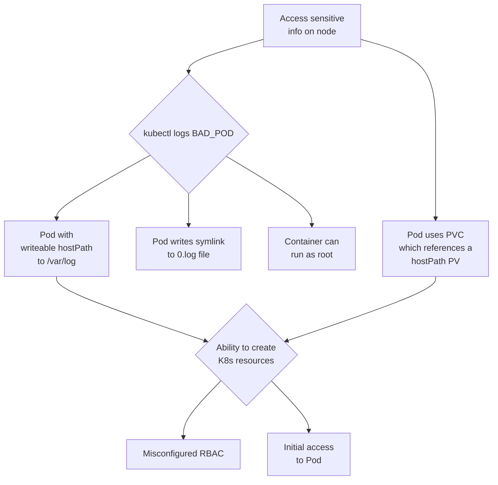

# HoneyCluster to verify and quantify an Attack Tree

## The four fold path to threat intelligence
1 Threat Model -> Attack Model

2 Instrument a honeycluster (with eBPF tripwires and some bait)

3 Trace and stream events, remove baseline

4 Disseminate the Threat Intelligence

## Simple Attack Tree

As a simple example attack tree, we will look at the attack path made possible if an attacker can create `/var/log` hostPath Persistent Volumes on a cluster, inspired by [this blog post](https://jackleadford.github.io/containers/2020/03/06/pvpost.html).



## Known Issues

Works on linux, but MACs are still having some hiccups WIP

## Demo

Bring all the infra up (known issue: wait conditions):

```bash
make all-up
```

You can view the Redpanda dashboard by browsing to: <http://localhost:30000/>

Note that `smb` (signal minus baseline), `tracessshpre` and `tracesssh` topics have been created in Redpanda. Make an SSH connection to the server, and note the corresponding message in the `tracesssh` topic:

```bash
make ssh-connect
```

Close the SSH connection, and run the full attack which will again make an SSH connection to our vulnerable server, run a malicious script which will create a HostPath type PersistentVolume, allowing a pod to access `/var/log` on the host (inspired by [this blog post](https://jackleadford.github.io/containers/2020/03/06/pvpost.html)), using the [Python Kubernetes client library](https://github.com/kubernetes-client/python). Note that you could modify the hostPath in the Python script to go directly for the data on the host that you want to compromise, however, in order to increase the number of attack steps in our scenario (and hence the number of indicators that we can look for), let's imagine that we are not able to create arbitrary hostPaths. In this scenario, perhaps a `hostPath` type `PersistentVolume` is allowed for `/var/log` so that a Pod can monitor other Pod's logs.

```bash
make attack
```

When prompted, the password is `root`.

If the service account compromised by our attacker could inspect the logs of the containers it can create, running `kubectl logs bad-pv-pod --tail=-1` (or making an API call from within the bad pod) will enable an attacker to view arbitrary files (line by line) on the host. In this example, we have a single node cluster, so we can access control plane data.

Note that we have a lot more messages in the `smb` topic following the attack. Additional topics can be configured to filter for the other attack steps by configuring `DIRS` in the Makefile.

### Teardown

```bash
make teardown
```

## Experiment to detect Leak Vessel on live clusters
No additional cluster instrumentation is needed


[](https://www.youtube.com/watch?v=RNYz86uDXLc)


## Note for Mac Users

Certain Docker Desktop versions will lead to the following error:

```text
level=fatal msg="Load overlay network failed" error="program cil_from_overlay: replacing clsact qdisc for interface cilium_vxlan: operation not supported" interface=cilium_vxlan subsys=datapath-loader
```

downgrading or using an alternative (Orbstack) will solve this.
