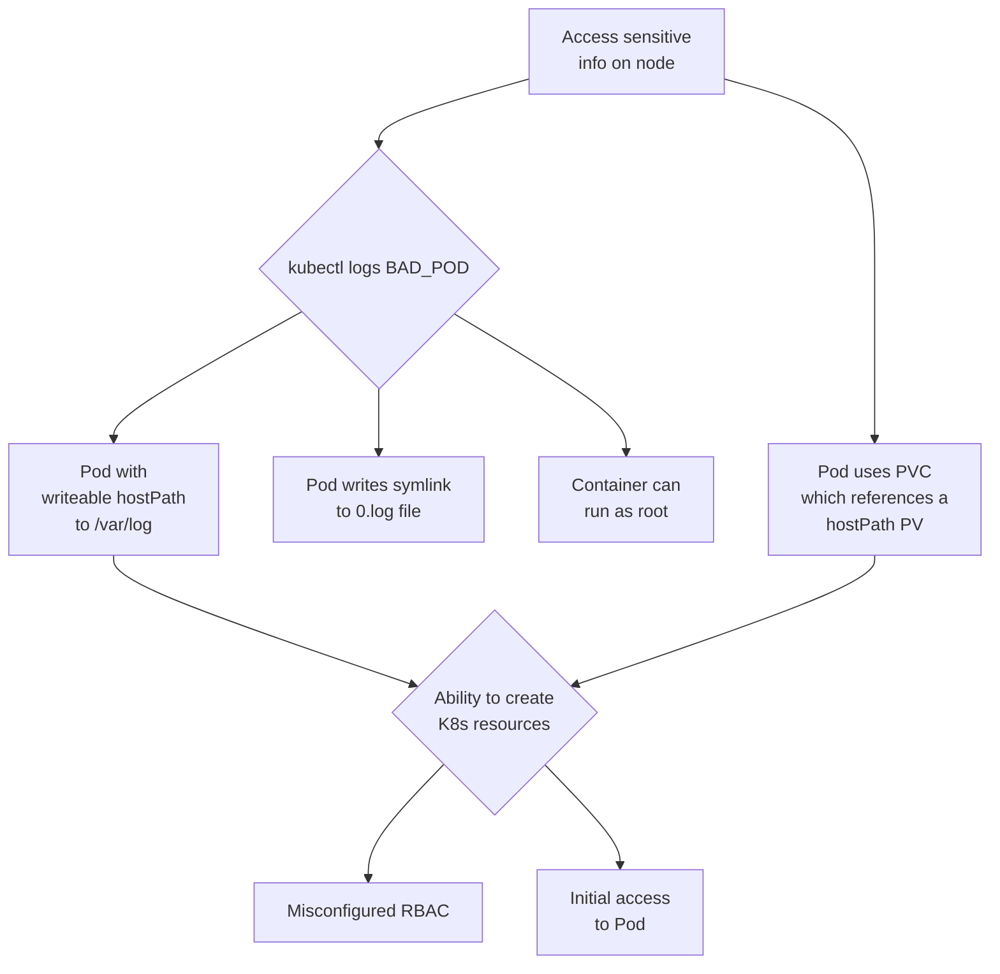
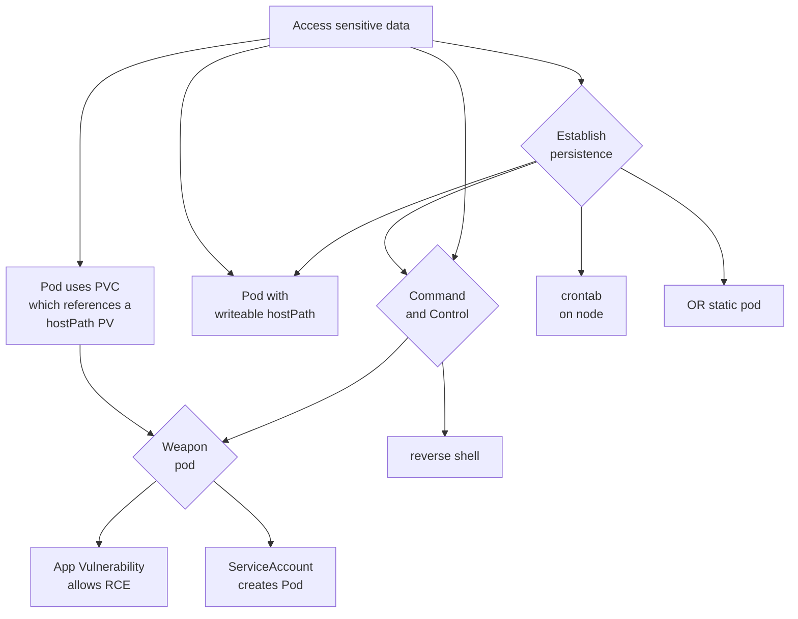

# HoneyCluster to verify and quantify attack paths
You start with your "normal" cluster, where you wish to

(A) verify/quantify theoretical threat modelling assumptions

or

(B) to simply observe  how your cluster will be attacked by interpreting the anomalous signals


## The four fold path to threat intelligence
1 Threat Model -> Attack Model -> Critical Attack Path

2 Instrument a honeycluster with eBPF tripwires and some bait

3 Trace and stream events, remove baseline

4 Disseminate the Threat Intelligence

## (A) Reference Implementation plus example attack

The idea is to take a cluster you have, copy/shrink it, replace sensitive data and the `honey-stack` on it


### 1 Example Attack Tree
As a simple example attack tree, we will look at the attack path made possible if an attacker can create `/var/log` hostPath Persistent Volumes on a cluster, inspired by [this blog post](https://jackleadford.github.io/containers/2020/03/06/pvpost.html).




### 2 Setup a Honeycluster
First, please note, that we are preparing some local explorative scenarios for which we use `kind` (see feature-branches for now). You will need to have certmanager installed and in case of `kind` you can achieve this by:

```bash
make cluster-up
```

(if you have your own kuberentes, it should be in your KUBECONF context and have all your own application already running on it)


The next step, once all applications incl cert-manager are running stable, is to verify that all `traces` are the ones you want (see Section Traces) and that they are added in the Makefile Section `traces` . You may also want to verify the log-forwarding exclusions of `vector` in values.yaml: `app_logs.type: kubernetes_logs.exclude_paths_glob_patterns:` and `tetragon` exclusions in values.yaml `  exportDenyList: |-` .

```bash
make  honey-up
```
This will install redpanda, vector, tetragon and some auxiliaries, and from here on the hashlists are being populated.
It is important the cluster is `not yet` exposed to an `active threat`.
At this point, you might want to port-forward to Redpanda dashboard (service redpanda-src-console) and browse to the TOPIC = keygen.
```bash
kubectl port-forward service/redpanda-src-console -n redpanda 30000:8080
```
http://localhost:30000/topics/keygen?p=-1&s=500&o=-2#messages

The messages on this topic, should be "BENIGN" as they stem from your apps, `kube-system` and the `honey-stack`. It is recommended to wait a while until all applications have gone through their typical behaviour.

### 3 Setup Baseline redaction


Once, you believe that all baseline behaviour has been captured, cut-off the hash-collection via `honey-signal` . This will insert the known benign hashes into `redis` and henceforth filter them out of the signal.

```bash
make honey-signal
...
stuff....
build successful
deploy your transform to a topic:
        rpk transform deploy
TOPIC   STATUS
signal  OK
transform "signal" deployed.
```

Test your detection on topic = `signal` .

You can alternatively forward all logs and traces to mongodb (or central collection point of your choice -> modify `redpanda/connect/config-external`) and activate the forwarders like so:
```bash
make redpanda-connect-mongo
```

### 4 Execute the sample attack
Depending on which eBPF traces you have deployed under traces/*.yaml , you can now deploy custom JQueries via WASM to stream/transform your data.

We prebuild in the example 6 Indicators of Compromise, using 10 tracingpolicies, and we deploy 6 wasm transform to seperate them into topics.
A deployment is currently manual (see Makefile_kind and find the jq-binary under prebuilt/jq.wasm )


Make an SSH connection to the server, and note the corresponding message in the `signal` , `tracessh` and `traceenum` topic:

```bash
make --makefile=Makefile_*** ssh-connect
ssh -p 5555 root@127.0.0.1
Handling connection for 5555
root@127.0.0.1's password: root
...
stuff
...
Ubuntu comes with ABSOLUTELY NO WARRANTY, to the extent permitted by
applicable law.

root@ssh-proxy:~# ls
```
At this point, you should see some `signal` in RedPanda. Approx 40-50 signals. Look out for a key starting with `kpro` and
it might contain the `ssh-spawn-bash` detection.


You could decide that you dont want to see all of the bash environment related signals, and copy paste the key e.g. exec69ef01cde4ec877c63652bf9d84e9210 and put it into `redis`
```bash
kubectl exec -n redpanda svc/redis-headless -- redis-cli SADD baseline "<key>"
```


More self-attack-experimentation:


Close the SSH connection, and run the full attack which will again make an SSH connection to our vulnerable server, run a malicious script which will create a HostPath type PersistentVolume, allowing a pod to access `/var/log` on the host (inspired by [this blog post](https://jackleadford.github.io/containers/2020/03/06/pvpost.html)), using the [Python Kubernetes client library](https://github.com/kubernetes-client/python). Note that you could modify the hostPath in the Python script to go directly for the data on the host that you want to compromise, however, in order to increase the number of attack steps in our scenario (and hence the number of indicators that we can look for), let's imagine that we are not able to create arbitrary hostPaths. In this scenario, perhaps a `hostPath` type `PersistentVolume` is allowed for `/var/log` so that a Pod can monitor other Pod's logs.

```bash
make --makefile=Makefile_attack bait
make --makefile=Makefile_attack attack
```

When prompted, the password is `root`.

If the service account compromised by our attacker could inspect the logs of the containers it can create, running `kubectl logs bad-pv-pod --tail=-1` (or making an API call from within the bad pod) will enable an attacker to view arbitrary files (line by line) on the host. In this example, we have a single node cluster, so we can access control plane data.

Note that we have a lot more messages in the `signal` topic following the attack. Additional topics can be configured to filter for the other attack steps by configuring `DIRS` in the Makefile.

[](https://www.youtube.com/watch?v=EcZcLz3kkUs)


The above screen recording shows the newly established ssh connection being picked up by the eBPF traces and appearing as anomaly in the topic `signalminusbaseline` (since, renamed to `signal` )  in the RedPandaUI and
filtered into the topic  `tracesssh`  on RedPanda (lower screen, shell `rpk topic consume tracesssh`).
### Teardown

Removing the bait and attack
```bash
make --makefile=Makefile_attack bait-delete
```

```bash
make wipe
```

# Tailoring the instrumentation to your needs
This repo (together with the [threatintel repo](https://github.com/k8sstormcenter/threatintel) aims at giving people/teams a framework to run experiments, simulations and make threat-modelling very concrete and actionable.
This is why we are working on providing some sample setups to understand what the various pieces do and how you can make them your own.

## Your Threat Model
A relatively generic Threat Model could look like this
e.g.

## Your Attack Model (Calibration and Verification, Simulation)
Based on the Threat Model, you now create a concrete AttackModel (or many).

You can use this for multiple purposes:

to understand if a ThreatModel can be exploited IRL . You can attack yourself or hire an offensive expert, create a bug bounty program etc.

to  calibrate all event-producing instrumentation in your deployment: can you see events from executing your attack-model, if not, you might need to add more TracingPolicies or change some filters.

to verify the pattern-matching between your events and your STIX observables: is the attack correctly picked up in your Neo4J/Stix database.

to simulate a breach: once you have at least one attack model implemented (e.g. via bash-script), you can test diverse detective/responsive processes in your deployment, e.g. if your pager starts blinking.


## Instrumenting Events I: Your TracingPolicies
This paragraph is about choosing Tetragon tracing policies that work for you. Tetragon uses eBPF technology to trace kernel and system events, providing detailed insights into system behavior.

Here's an example tracing policy:

```yaml
apiVersion: cilium.io/v1alpha1
kind: TracingPolicy
metadata:
  name: "monitor-network-activity-outside-cluster-cidr-range"
spec:
  kprobes:
  - call: "tcp_connect"
    syscall: false
    args:
    - index: 0
      type: "sock"
    selectors:
    - matchArgs:
      - index: 0
        operator: "NotDAddr"
        values:
        - 127.0.0.1
        - 172.16.0.0/28
        - 192.168.64.0/24
```

In this example, the policy monitors tcp_connect events, filtering out connections to specific IP ranges and capturing only those to other addresses. This helps ensure that only relevant and interesting tcp information is gathered. See subfolder `/traces` for more examples.

## Instrumenting Events II: Your Logs
This paragraph is about application (incl audit) and networking logs. WIP

Coming soon: examples and how to test it locally
## Mapping and Matching: Stix Observables and Stix Indicators
Using the [threatintel repo](https://github.com/k8sstormcenter/threatintel), the collected logs are transformed into [STIX observables](https://docs.oasis-open.org/cti/stix/v2.1/cs01/stix-v2.1-cs01.html#_mlbmudhl16lr), which are then matched against [STIX indicators](https://docs.oasis-open.org/cti/stix/v2.1/cs01/stix-v2.1-cs01.html#_muftrcpnf89v). Observables, which match the provided indicators represent potentially malicious behavior and are persisted into a document store. More detailed information on the setup of the indicators and how the matching works is provided in the [README](https://github.com/k8sstormcenter/threatintel/blob/main/README.md) of the threatintel repository.

[](https://drive.google.com/file/d/1RfPr_7RmXDlU22-l7ZFoMnWJKloP0VpG/view?usp=sharing)

## Explorative analysis
INSERT Video-Clip from KCD Munich HERE

Coming soon

## (B) Experiment to detect Leaky Vessel on live clusters
We show a simple and unspecific detection of Leaky Vessel via Supply Chain (cf .KubeCon Europe 2024) and an elaborate breach using Leaky Vessel for `priviledge escalation` (cf. KCD Munich 2024).

No additional cluster instrumentation was needed, no specific assumptions etc were made.


The video below shows the poisoning of a registry with an image exploiting CVE-2024-21626 "Leaky-Vessel" by tagging and pushing the poisoned image with identical name/tag as the original image. (This is a type of Supply Chain Attack).

Two different RKE2 clusters (intentionally running a vulnerable `runc`) are observed by streaming the `smb` topic in the RedPandaUI. When the poisoned image is pulled and started up, the traces appear on the topic. As well as we see the sensitive-file-access to the private key on the host-node, as well as the newly created file `LEAKYLEAKY` on the host node.


[](https://www.youtube.com/watch?v=RNYz86uDXLc)


# Bait
Please join us on Slack to talk about that


## Security Considerations

Given this is an insecure and experimental setup of a honeypot-infrastructure, there are several additional measures taken that are not covered in the talk or this repo.
This repo is for demonstration purposes only.


# Contributing
Contributions are welcome

In the form of testing, feedback, code, PRs, eBPF tripwires, realistic threatmodels, mappings onto the critical attack path...

TODO: write contributor guidelines


