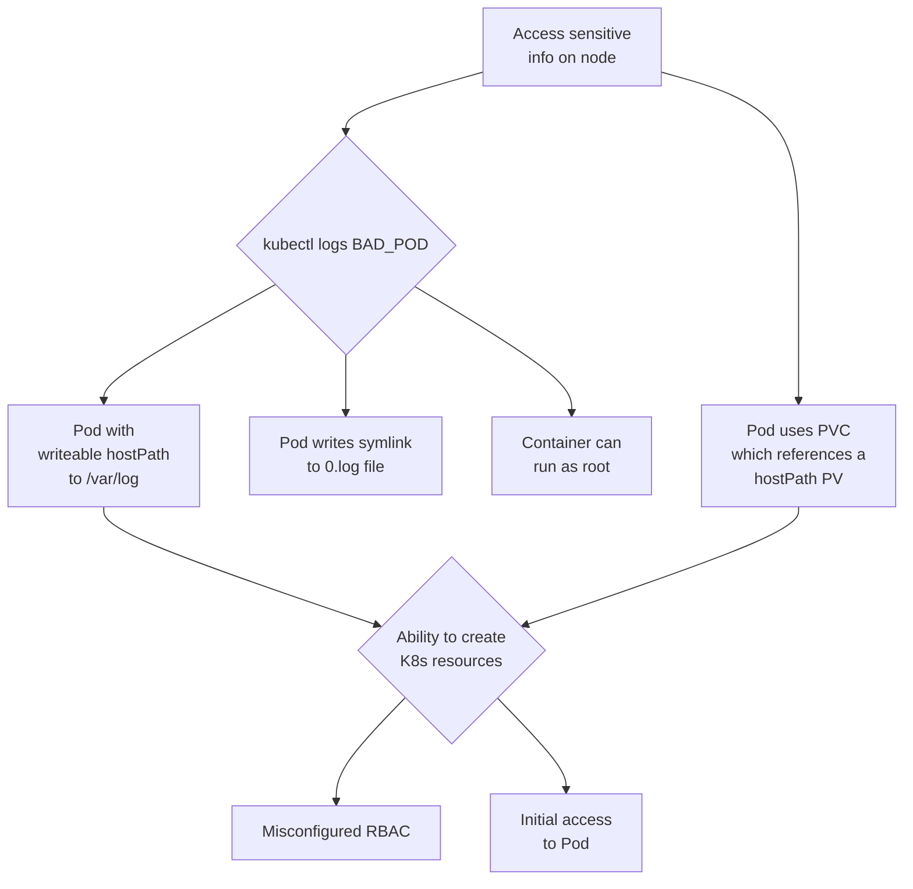

# HoneyCluster to verify and quantify attack paths
You start with your "normal" cluster, where you wish to

(A) verify/quantify theoretical threat modelling assumptions

or 

(B) to simply observe  how your cluster will be attacked by interpreting the anomalous signals

## The four fold path to threat intelligence
1 Threat Model -> Attack Model -> Critical Attack Path

2 Instrument a honeycluster with eBPF tripwires and some bait

3 Trace and stream events, remove baseline

4 Disseminate the Threat Intelligence

## (A) Simple Attack Tree

As a simple example attack tree, we will look at the attack path made possible if an attacker can create `/var/log` hostPath Persistent Volumes on a cluster, inspired by [this blog post](https://jackleadford.github.io/containers/2020/03/06/pvpost.html).



## Known Issues

Works on linux, but MACs are still having some hiccups WIP

## Demo

Bring all the infra up (known issue: wait conditions):

```bash
make --makefile=Makefile_kind all-up
```

You can view the Redpanda dashboard by browsing to: <http://localhost:30000/>

Note that `smb` (signal minus baseline), `tracessshpre` and `tracesssh` topics have been created in Redpanda. Make an SSH connection to the server, and note the corresponding message in the `tracesssh` topic:

```bash
make --makefile=Makefile_kind ssh-connect
```

Close the SSH connection, and run the full attack which will again make an SSH connection to our vulnerable server, run a malicious script which will create a HostPath type PersistentVolume, allowing a pod to access `/var/log` on the host (inspired by [this blog post](https://jackleadford.github.io/containers/2020/03/06/pvpost.html)), using the [Python Kubernetes client library](https://github.com/kubernetes-client/python). Note that you could modify the hostPath in the Python script to go directly for the data on the host that you want to compromise, however, in order to increase the number of attack steps in our scenario (and hence the number of indicators that we can look for), let's imagine that we are not able to create arbitrary hostPaths. In this scenario, perhaps a `hostPath` type `PersistentVolume` is allowed for `/var/log` so that a Pod can monitor other Pod's logs.

```bash
make --makefile=Makefile_kind attack
```

When prompted, the password is `root`.

If the service account compromised by our attacker could inspect the logs of the containers it can create, running `kubectl logs bad-pv-pod --tail=-1` (or making an API call from within the bad pod) will enable an attacker to view arbitrary files (line by line) on the host. In this example, we have a single node cluster, so we can access control plane data.

Note that we have a lot more messages in the `smb` topic following the attack. Additional topics can be configured to filter for the other attack steps by configuring `DIRS` in the Makefile.

[](https://www.youtube.com/watch?v=EcZcLz3kkUs)


The above screen recording shows the newly established ssh connection being picked up by the eBPF traces and appearing as anomaly in the topic `signalminusbaseline` (=`smb`) in the RedPandaUI and 
filtered into the topic  `tracesssh`  on RedPanda (lower screen, shell `rpk topic consume tracesssh`).
### Teardown of Kind

```bash
make --makefile=Makefile_kind teardown
```

## (B) Experiment to detect Leaky Vessel on live clusters
No additional cluster instrumentation is needed, no specific assumptions etc were made.

The video below shows the poisoning of a registry with an image exploiting CVE-2024-21626 "Leaky-Vessel" by tagging and pushing the poisoned image with identical name/tag as the original image. (This is a type of Supply Chain Attack).

Two different RKE2 clusters (intentionally running a vulnerable `runc`) are observed by streaming the `smb` topic in the RedPandaUI. When the poisoned image is pulled and started up, the traces appear on the topic. As well as we see the sensitive-file-access to the private key on the host-node, as well as the newly created file `LEAKYLEAKY` on the host node.


[](https://www.youtube.com/watch?v=RNYz86uDXLc)


# Deploying a real Honeycluster

## Example on RKE2 (on openstack)

In the KubeCon EU talk, we present two "real" clusters, they are hosted on a RKE2 1.27 with Rancher running.
This type of honeycluster is supposed to look like a experimental kubernetes-cluster on which an SRE is actively debugging something.
This SRE is useing insecure reverse SSH to login to the cluster via a jump-host, no modifications to the corporate firewall are required.


## Security Considerations

Given this is an insecure and experimental setup of a honeypot-infrastructure, there are several additional measures taken that are not covered in the talk or this repo.
This repo is for demonstration purposes only.

## Setup

1) Edit all values "rke2values.yaml" for your own cluster. We assume that you have cert-manager, an ingress-class (we use nginx) and some storage. You dont need to be running cilium as CNI, but we are. 

2) For the leaky vessel exploit: it likely doesnt work, as must runc are patched now. In the talk we presented a intentionally downgraded runc. 

```bash
make --makefile=Makefile_rke2 install-honeycluster
```

## WASM compilation for any transform not in the prebuilt folder
(you STILL need Go 1.21 installed, WIP to remove this requirement from the base-install)
IF in the above step you have GO errors, it is because the following command compiles the WASM binaries:

```bash
make --makefile=Makefile_rke2 redpanda-wasm
```


