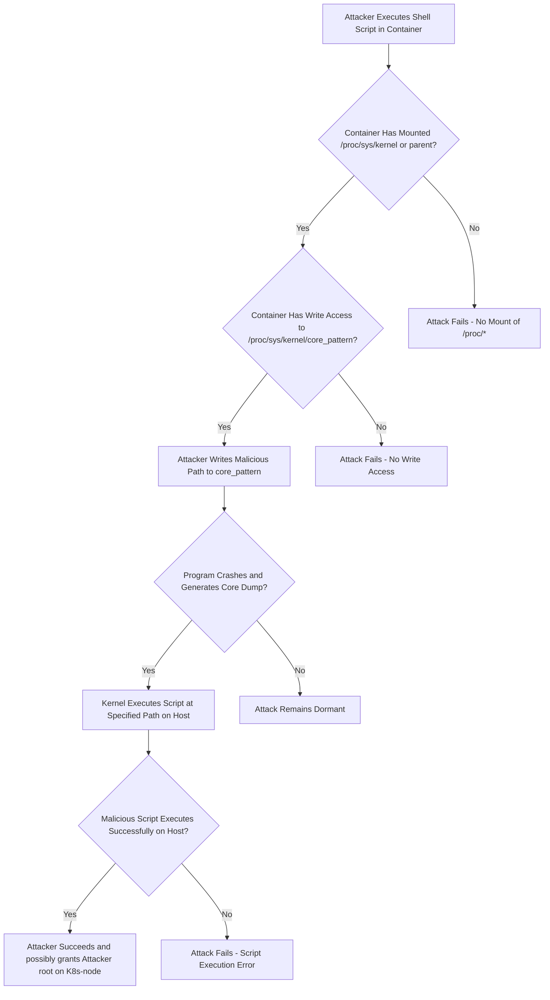

```mermaid
flowchart TD
    A[Attacker Executes Shell Script in Container] --> B{Container Has Mounted /proc/sys/kernel or parent?};
    B -- Yes --> C{Container Has Write Access to /proc/sys/kernel/core_pattern?};
    B -- No --> N[Attack Fails - No Mount of /proc/*];
    C -- Yes --> D[Attacker Writes Malicious Path to core_pattern];
    C -- No --> O[Attack Fails - No Write Access];
    D --> E{Program Crashes and Generates Core Dump?};
    E -- Yes --> F[Kernel Executes Script at Specified Path on Host];
    E -- No --> G[Attack Remains Dormant];
    F --> H{Malicious Script Executes Successfully on Host?};
    H -- Yes --> I[Attacker Succeeds and possibly grants Attacker root on K8s-node];
    H -- No --> J[Attack Fails - Script Execution Error];
```
